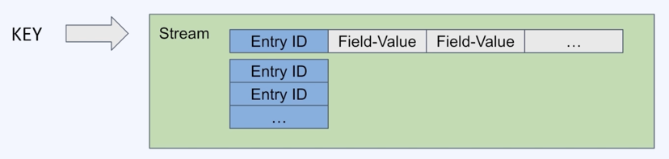

## Redis Streams
* append-only log를 구현한 자료 구조
* 하나의 key로 식별되는 하나의 stream에 엔트리가 계속 추가되는 구조
* 하나의 엔트리는 entry ID + (key-value 리스트)로 구성
* 추가된 데이터는 사용자가 삭제하지 않는 한 지워지지 않음

### Redis Streams의 활용
* 센서 모니터링(지속적으로 변하는 데이터인 시간 별 날씨 수집 등)
* 유저별 알림 데이터 저장
* 이벤트 저장소

### Redis Streams 명령어
* 엔트리 추가.
  * XADD key ID [field value ...]
  * example ) XADD user-notification * user-a hi user-b hello 
* 엔트리 읽기 (범위 기반)
  * XRANGE key start end [COUNT count]
  * example ) XRANGE user-notification - + COUNT 2
* 엔트리 읽기 (offset 기반)
  * XREAD BLOCK [milliseconds] STREAMS key ID
  * example ) XREAD BLOCK 0 STREAMS user-notification 0 -> user-notifications의 0보다 큰 id조회
* 엔트리 읽기 (offest 기반) -2
  * user-notifications에 새로 들어오는 엔트리를 동기 방식으로 조회
  * 앞으로 들어올 데이터를 동기 방식으로 조회하여 event listener와 같은 방식으로 사용가능
  * XREAD BLOCK 0 STREAMS user-notification $  
  
   
    
* Consumer Group
  * 한 stream을 여러 consumer가 분산 처리 할 수 있는 방식
  * 하나의 그룹에 속한 consumer는 서로 다른 엔트리들을 조회하게 됨.

* Consumer Group 생성
  * XGROUP CREATE key groupname id
  * example ) XGROUP CREATE user-notification user-notification-group1 $
* Consumer Group -2
  * XREADGROUP GROUP groupname consumername COUNT count STREAMS key ID
  * example ) XREADGROUP GROUP consumer1 COUNT 1 STREAMS user-notification >
  * example ) XREADGROUP GROUP consumer2 COUNT 1 STREAMS user-notification >

## Persistent on Disk 
* RDB ( Snapshot )
  * Redis Database의 Snapshot을 Disk에 저장하는 방식(backup)
* AOF ( Append Only File )
  * Redis Database의 모든 write/update 명령어를 append-only log 형태로 저장하는 방식